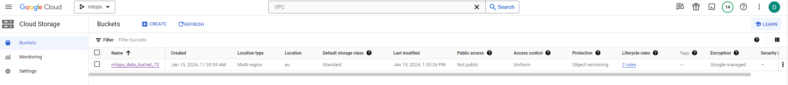

# Exam template for 02476 Machine Learning Operations

This is the report template for the exam. Please only remove the text formatted as with three dashes in front and behind
like:

```--- question 1 fill here ---```

where you instead should add your answers. Any other changes may have unwanted consequences when your report is auto
generated in the end of the course. For questions where you are asked to include images, start by adding the image to
the `figures` subfolder (please only use `.png`, `.jpg` or `.jpeg`) and then add the following code in your answer:

```markdown

```

In addition to this markdown file, we also provide the `report.py` script that provides two utility functions:

Running:

```bash
python report.py html
```

will generate an `.html` page of your report. After deadline for answering this template, we will autoscrape
everything in this `reports` folder and then use this utility to generate an `.html` page that will be your serve
as your final handin.

Running

```bash
python report.py check
```

will check your answers in this template against the constrains listed for each question e.g. is your answer too
short, too long, have you included an image when asked to.

For both functions to work it is important that you do not rename anything. The script have two dependencies that can
be installed with `pip install click markdown`.

## Overall project checklist

The checklist is *exhaustic* which means that it includes everything that you could possible do on the project in
relation the curricilum in this course. Therefore, we do not expect at all that you have checked of all boxes at the
end of the project.

### Week 1

* [X] Create a git repository
* [X] Make sure that all team members have write access to the github repository
* [X] Create a dedicated environment for you project to keep track of your packages
* [X] Create the initial file structure using cookiecutter
* [X] Fill out the `make_dataset.py` file such that it downloads whatever data you need and
* [X] Add a model file and a training script and get that running
* [X] Remember to fill out the `requirements.txt` file with whatever dependencies that you are using
* [X] Remember to comply with good coding practices (`pep8`) while doing the project
* [X] Do a bit of code typing and remember to document essential parts of your code
* [X] Setup version control for your data or part of your data
* [X] Construct one or multiple docker files for your code
* [X] Build the docker files locally and make sure they work as intended
* [X] Write one or multiple configurations files for your experiments
* [X] Used Hydra to load the configurations and manage your hyperparameters
* [ ] When you have something that works somewhat, remember at some point to to some profiling and see if
      you can optimize your code
* [X] Use Weights & Biases to log training progress and other important metrics/artifacts in your code. Additionally,
      consider running a hyperparameter optimization sweep.
* [ ] Use Pytorch-lightning (if applicable) to reduce the amount of boilerplate in your code

### Week 2

* [X] Write unit tests related to the data part of your code
* [X] Write unit tests related to model construction and or model training
* [ ] Calculate the coverage.
* [ ] Get some continuous integration running on the github repository
* [X] Create a data storage in GCP Bucket for you data and preferable link this with your data version control setup
* [X] Create a trigger workflow for automatically building your docker images
* [X] Get your model training in GCP using either the Engine or Vertex AI
* [X] Create a FastAPI application that can do inference using your model
* [ ] If applicable, consider deploying the model locally using torchserve
* [ ] Deploy your model in GCP using either Functions or Run as the backend

 
### Week 3

* [ ] Check how robust your model is towards data drifting
* [ ] Setup monitoring for the system telemetry of your deployed model
* [ ] Setup monitoring for the performance of your deployed model
* [ ] If applicable, play around with distributed data loading
* [ ] If applicable, play around with distributed model training
* [ ] Play around with quantization, compilation and pruning for you trained models to increase inference speed

### Additional

* [X] Revisit your initial project description. Did the project turn out as you wanted?
* [X] Make sure all group members have a understanding about all parts of the project
* [X] Uploaded all your code to github

## Group information

### Question 1
> **Enter the group number you signed up on <learn.inside.dtu.dk>**
>
> Answer:

72

### Question 2
> **Enter the study number for each member in the group**
>
> Example:
>
> *sXXXXXX, sXXXXXX, sXXXXXX*
>
> Answer:

 s233593, s223730, s222883, s230148

### Question 3
> **What framework did you choose to work with and did it help you complete the project?**
>
> Answer length: 100-200 words.
>
> Example:
> *We used the third-party framework ... in our project. We used functionality ... and functionality ... from the*
> *package to do ... and ... in our project*.
>
> Answer:

We used the third-party framework fastai in our project. We used their tabular learner as our model and trained it using their fit_one_cycle function.

## Coding environment

> In the following section we are interested in learning more about you local development environment.

### Question 4

> **Explain how you managed dependencies in your project? Explain the process a new team member would have to go**
> **through to get an exact copy of your environment.**
>
> Answer length: 100-200 words
>
> Example:
> *We used ... for managing our dependencies. The list of dependencies was auto-generated using ... . To get a*
> *complete copy of our development environment, one would have to run the following commands*
>
> Answer:

We used a requirements.txt file for managing our dependencies. We then each had a virtual environment locally saved in the repository folder that we used with pip to have the right versions of packages installed.

### Question 5

> **We expect that you initialized your project using the cookiecutter template. Explain the overall structure of your**
> **code. Did you fill out every folder or only a subset?**
>
> Answer length: 100-200 words
>
> Example:
> *From the cookiecutter template we have filled out the ... , ... and ... folder. We have removed the ... folder*
> *because we did not use any ... in our project. We have added an ... folder that contains ... for running our*
> *experiments.*
> Answer:

We added a config folder to use with hydra for our hyperparameters. We then removed the notebooks folders since we didn't need any notebooks for our implementation and then also removed the model.py file inside project/models since our model was built using fastai. Lastly we also removes the visualizations folder inside of the project folder since our model didn't call for any visualizations.

### Question 6

> **Did you implement any rules for code quality and format? Additionally, explain with your own words why these**
> **concepts matters in larger projects.**
>
> Answer length: 50-100 words.
>
> Answer:


Yes, we implemented rules for code quality and format in our project. We used Ruff in our GitHub Actions workflow. This helps ensure that all the code we write follows style and quality guidelines.

In larger projects, having rules for code quality and format is very important because it keeps the code consistent and readable for everyone on the team. It's like having a common language that everyone follows, which makes it easier to understand and work on each other's code. Plus, it helps prevent small errors that can lead to bigger problems later on (technical debt). 

## Version control

> In the following section we are interested in how version control was used in your project during development to
> corporate and increase the quality of your code.

### Question 7

> **How many tests did you implement and what are they testing in your code?**
>
> Answer length: 50-100 words.
>
> Example:
> *In total we have implemented X tests. Primarily we are testing ... and ... as these the most critical parts of our*
> *application but also ... .*
>
> Answer:

We implemented a test to check that the data was loaded in correctly. In the test_model_train.py file, we created tests to check different parts of our training process. We tested,

Data Loading: if our training and testing datasets are correctly loaded. We make sure that these datasets are not empty and contain the necessary columns, like 'income', which we need for training.

Model Training: We test the function that trains our model. We pass our training data to this function, including the features we want to use and the target variable 'income'. We check if the function successfully trains the model and returns a trained model object.

We use pytest to set up our data before running the tests, and we use assert statements to ensure that the outcomes of the functions we're testing. Both tests are also part of our Github Actions workflow and are triggered everytime code is pushed or merged into main.

### Question 8

> **What is the total code coverage (in percentage) of your code? If you code had an code coverage of 100% (or close**
> **to), would you still trust it to be error free? Explain you reasoning.**
>
> Answer length: 100-200 words.
>
> Example:
> *The total code coverage of code is X%, which includes all our source code. We are far from 100% coverage of our **
> *code and even if we were then...*
>
> Answer:

Our coverage is very small due to only testing the dataloading and we're still confident in the code working correctly due to the model accuracy being satisfactory and the remaining code being quite simple. 

### Question 9

> **Did you workflow include using branches and pull requests? If yes, explain how. If not, explain how branches and**
> **pull request can help improve version control.**
>
> Answer length: 100-200 words.
>
> Example:
> *We made use of both branches and PRs in our project. In our group, each member had an branch that they worked on in*
> *addition to the main branch. To merge code we ...*
>
> Answer:

We did indeed use branches in our group so that we could all work on different things at the same time without any causing any errors. When someone was done with their part they would upload it to their own branch and someone else would review it and merge it.
The workflow when you wanted to add a new feature to the code (or correct a bug) was the following:
First you would git checkout main and pull the most recent changes. After this you would create a branch called feat/feature_name (or bug/bug_name). When finished with the changes you will pull to check if any changes have been made to main and then git rebase main to place your branch changes on top of the main ones. Then you would push your branch changes and create a Pull Request in the Github browser describing your commit. The main branch is protected so someone has to approve your PR before merging it.
We know that this whole process may be a bit tedious for this kind of small projects, but we wanted to ensure the scalability and reliability of the code (as if main was the production branch).

### Question 10

> **Did you use DVC for managing data in your project? If yes, then how did it improve your project to have version**
> **control of your data. If no, explain a case where it would be beneficial to have version control of your data.**
>
> Answer length: 100-200 words.
>
> Example:
> *We did make use of DVC in the following way: ... . In the end it helped us in ... for controlling ... part of our*
> *pipeline*
>
> Answer:

We set up DVC for managing our data, it was however not necessary by any means due to the small size of our data. Version control of data becomes useful when you have large collections of data that are getting processed, to make sure that the right versions of the data are used by the right models.

### Question 11

> **Discuss you continues integration setup. What kind of CI are you running (unittesting, linting, etc.)? Do you test**
> **multiple operating systems, python version etc. Do you make use of caching? Feel free to insert a link to one of**
> **your github actions workflow.**
>
> Answer length: 200-300 words.
>
> Example:
> *We have organized our CI into 3 separate files: one for doing ..., one for running ... testing and one for running*
> *... . In particular for our ..., we used ... .An example of a triggered workflow can be seen here: <weblink>*
>
> Answer:

Sadly, we did not have the time to setup continuous integration as a part of this project.


## Running code and tracking experiments

> In the following section we are interested in learning more about the experimental setup for running your code and
> especially the reproducibility of your experiments.

### Question 12

> **How did you configure experiments? Did you make use of config files? Explain with coding examples of how you would**
> **run a experiment.**
>
> Answer length: 50-100 words.
>
> Example:
> *We used a simple argparser, that worked in the following way: python my_script.py --lr 1e-3 --batch_size 25*
>
> Answer:

 We used a config file to specify our hyperparameters meaning that to run the code you just have to run python train_model.py . If you want to adjust the parameters just adjust the values in config/hyperparameters.yaml .

### Question 13

> **Reproducibility of experiments are important. Related to the last question, how did you secure that no information**
> **is lost when running experiments and that your experiments are reproducible?**
>
> Answer length: 100-200 words.
>
> Example:
> *We made use of config files. Whenever an experiment is run the following happens: ... . To reproduce an experiment*
> *one would have to do ...*
>
> Answer:

To make sure that a training experiment is reproducable we used a make sure that the data split is the same everytime the code is ran, either through a seed or by splitting the data in order. To further make sure that experiments are reproducible, we've created a docker image that can be used to have the same conditions as we did when running the code.

### Question 14

> **Upload 1 to 3 screenshots that show the experiments that you have done in W&B (or another experiment tracking**
> **service of your choice). This may include loss graphs, logged images, hyperparameter sweeps etc. You can take**
> **Explain what metrics you are tracking and why they are**
> **important.**

Here are our 

Due to the simplicity of our model, we are only tracking a couple of several key metrics to evaluate the performance and behavior of our model. The metrics help us understand how our model is performing and identify areas for improvement. 

Accuracy (training loss and validation loss): This measures how often our model correctly predicts the target variable. We track accuracy because it gives us a straightforward indication of the model's effectiveness. 

Learning Rate: The learning rate shows how the model learns from the data during training. It influences the size of the steps the model takes when adjusting its weights in response to the error it observes.

Prediction Details: We log the actual predictions made by our model. This is important because it lets us compare it against the true values.


We track these metrics using wandb when training the model in train_model.py, and we use WandbCallback, a special feature in wandb implemented for fastai.


### Question 15

> **Docker is an important tool for creating containerized applications. Explain how you used docker in your**
> **experiments? Include how you would run your docker images and include a link to one of your docker files.**
>
> Answer length: 100-200 words.
>
> Example:
> *For our project we developed several images: one for training, inference and deployment. For example to run the*
> *training docker image: `docker run trainer:latest lr=1e-3 batch_size=64`. Link to docker file: <weblink>*
>
> Answer:

--- We created two images, one for training and storing the trained model and another for making the predictions. As I dont have GPU in my personal computer, I just run the images using CPU.
The train image just makes the data and then trains the model before saving it into the models folder. This is how the train dockerfile looks like:
# Base image
FROM python:3.11-slim

RUN apt update && \
    apt install --no-install-recommends -y build-essential gcc && \
    apt clean && rm -rf /var/lib/apt/lists/*

COPY requirements.txt requirements.txt
COPY pyproject.toml pyproject.toml
COPY tbd/ tbd/
COPY data/ data/
COPY models/ models/

WORKDIR /
RUN pip install -r requirements.txt
RUN pip install . --no-deps

ENTRYPOINT ["python", "-u", "tbd/models/train_model.py"]

This is how it looks like:


 ---

### Question 16

> **When running into bugs while trying to run your experiments, how did you perform debugging? Additionally, did you**
> **try to profile your code or do you think it is already perfect?**
>
> Answer length: 100-200 words.
>
> Example:
> *Debugging method was dependent on group member. Some just used ... and others used ... . We did a single profiling*
> *run of our main code at some point that showed ...*
>
> Answer:

Due to the simplicity of our training code, we did not find that using a python debugger would be necesarry. The amount of bugs we encountered were minimal and could easily be found using breakpoints and print statements.

## Working in the cloud

> In the following section we would like to know more about your experience when developing in the cloud.

### Question 17

> **List all the GCP services that you made use of in your project and shortly explain what each service does?**
>
> Answer length: 50-200 words.
>
> Example:
> *We used the following two services: Engine and Bucket. Engine is used for... and Bucket is used for...*
> 
> Answer:

--- We have used two primary GCP services: Google Cloud Compute Engine and Google Cloud Storage (bucket)

Google Cloud Storage provides scalable and secure object storage on the cloud. It's used for storing large datasets, with 'buckets' serving as the primary containers for data. Users can specify unique bucket names, storage classes, and locations.

As previously mentioned, we set up the dvc configuration to have the data stored in Google Drive. However, we wanted to store the data in Google Cloud instead, so we created a bucket.
To make the data storage process more secure (let's suppose we are working with sensitive data as patients data) we decided to create a service account. 

Google Cloud Compute Engine offers a service within the Google Cloud Platform for creating, configuring, and scaling virtual machines quickly. It's cost-effective, secure, and allows for rapid scaling and customization of infrastructure. Users can choose the precise zone and region for their data resources, making it suitable for a variety of applications including databases and websites.
We requested a GPU even though the training was completely doable with local resources. The reason being we had the scalability as one of the main goals of the project.   ---

### Question 18

> **The backbone of GCP is the Compute engine. Explained how you made use of this service and what type of VMs**
> **you used?**
>
> Answer length: 100-200 words.
>
> Example:
> *We used the compute engine to run our ... . We used instances with the following hardware: ... and we started the*
> *using a custom container: ...*
>
> Answer:
First we started creating a simple VM instance to try out Google Cloud and test that the model was succesfully run from there. 
We chose the closest location to reduce latency. For the resources we chose one of the cheapest as our data set is rather small and we did not want to spend the 50$ before finishing.
Machine type - n1-standard-1
CPU platform - Intel Haswell

We also configure an instance to allow GPU usage just to make sure we could have scalated the model if more GPU was required. For this we had to reques an update of the resources in the QUOTA menu.
We only requested 1 so they accept quickly the upgrade. This is the command used to create this second instance:
gcloud compute instances create "mlopsgpu" \
    --zone="europe-west4-a" \
    --image-family="pytorch-latest-gpu" \
    --image-project=deeplearning-platform-release \
    --accelerator="type=nvidia-tesla-p100,count=1" \
    --maintenance-policy=TERMINATE \
    --metadata="install-nvidia-driver=True" \
    

### Question 19

> **Insert 1-2 images of your GCP bucket, such that we can see what data you have stored in it.**
> **You can take inspiration from [this figure](figures/bucket.png).**
>
> Answer:
First, image shows the basic configuration, setting Protection as Object versioning to allow dvc to work with it.

Under the folder the raw data is stored, as we can see here:


### Question 20

> **Upload one image of your GCP container registry, such that we can see the different images that you have stored.**
> **You can take inspiration from [this figure](figures/registry.png).**
>
> Answer:

---  ---

### Question 21

> **Upload one image of your GCP cloud build history, so we can see the history of the images that have been build in**
> **your project. You can take inspiration from [this figure](figures/build.png).**
>
> Answer:

---  ---

### Question 22

> **Did you manage to deploy your model, either in locally or cloud? If not, describe why. If yes, describe how and**
> **preferably how you invoke your deployed service?**
>
> Answer length: 100-200 words.
>
> Example:
> *For deployment we wrapped our model into application using ... . We first tried locally serving the model, which*
> *worked. Afterwards we deployed it in the cloud, using ... . To invoke the service an user would call*
> *`curl -X POST -F "file=@file.json"<weburl>`*
>
> Answer:

We deployed our model locally using fastapi in our app.py file. When running "uvicorn app:app --reload" a local server stars, which can interactively be used by opening a browser and going to http://127.0.0.1:8000/docs . There you can input data which the model will use to calculate a prediction of whether or not you earn more than 50k USD a year.

### Question 23

> **Did you manage to implement monitoring of your deployed model? If yes, explain how it works. If not, explain how**
> **monitoring would help the longevity of your application.**
>
> Answer length: 100-200 words.
>
> Example:
> *We did not manage to implement monitoring. We would like to have monitoring implemented such that over time we could*
> *measure ... and ... that would inform us about this ... behaviour of our application.*
>
> Answer:

We did not employ monitoring of the deployed model due to time constraints. If we were to employ it, it could help improve user experience by monitoring their behaviour, allowing us to make changes accordingly. It could also be useful to see resource allocation which could be very relevant as the deployed model stays up.


(MISSING)

### Question 24

> **How many credits did you end up using during the project and what service was most expensive?**
>
> Answer length: 25-100 words.
>
> Example:
> *Group member 1 used ..., Group member 2 used ..., in total ... credits was spend during development. The service*
> *costing the most was ... due to ...*
>
> Answer:

---Overall we the Compute engine was the most expensive service. The costs are variable depending on the date with some days that the Bucket service is even higher that the Engine.
---

(MISSING)

## Overall discussion of project

> In the following section we would like you to think about the general structure of your project.

### Question 25

> **Include a figure that describes the overall architecture of your system and what services that you make use of.**
> **You can take inspiration from [this figure](figures/overview.png). Additionally in your own words, explain the**
> **overall steps in figure.**
>
> Answer length: 200-400 words
>
> Example:
>
> *The starting point of the diagram is our local setup, where we integrated ... and ... and ... into our code.*
> *Whenever we commit code and puch to github, it auto triggers ... and ... . From there the diagram shows ...*
>
> Answer:

--- question 25 fill here ---


--  ---

The starting point of our project was the actual code needed to train our model. We used the fastai module's tabular learner, based on pytorch, which worked quite flawlessly and cleanly. We then used github to store our code in the cookiecutter template that was given to us in the course. When making changes in the code we simply made a new branch and merged it into the repository. Even though the model could easily be trained locally, we used GCP to train the model and wandb to track the training progress. Once we had a trained model we used fastapi to deploy the model locally, allowing us to easily make predictions about people's incomes.

### Question 26

> **Discuss the overall struggles of the project. Where did you spend most time and what did you do to overcome these**
> **challenges?**
>
> Answer length: 200-400 words.
>
> Example:
> *The biggest challenges in the project was using ... tool to do ... . The reason for this was ...*
>
> Answer:
s222883: There was an issue with the cloud ssh keys autorization which didn't allow me to run locally gcloud compute ssh. It was annoying and I couldn't solve it. However I still had the access through the GC integrated terminal.
Then when building the docker images in the GC there I spent some time figuring out an error as you cannot use build --mount option.
s223730: Understanding containers. Tutorials and Youtube videos. 
s233593: Loading the saved model and using it to predict for the local deployment of the model actually proved to give us a lot of issues.
s230148: Working with dockers. It was the first time and I struggled to figure out.

### Question 27

> **State the individual contributions of each team member. This is required information from DTU, because we need to**
> **make sure all members contributed actively to the project**
>
> Answer length: 50-200 words.
>
> Example:
> *Student sXXXXXX was in charge of developing of setting up the initial cookie cutter project and developing of the*
> *docker containers for training our applications.*
> *Student sXXXXXX was in charge of training our models in the cloud and deploying them afterwards.*
> *All members contributed to code by...*
>
> Answer:

--- 
- s222883: 
    + Git repo and cookiecutter template.
    + Data Version Control (DVC) both in Google Drive and Google Cloud.
    + Docker locally.
    + Get the model training in Google Cloud using Engine.
    + GCP Bucket configuration and set up to use it with DVC.
    + Create trigger in Github to automatically create docker images when pushing new changes.
    
- s233593:
    + Training code for model
    + FastAPI deployment
    + Hydra configuration
    + Report writing

- s223730:
    + logging: WandB
    + tests: pytest
    + formatting/linting: ruff
    + Github Actions workflow
 
  -s230148
  + unit tests
  + env requirements
  + model parameters
  + project reporting 
 ---

### Question 28
Meme of the projct


